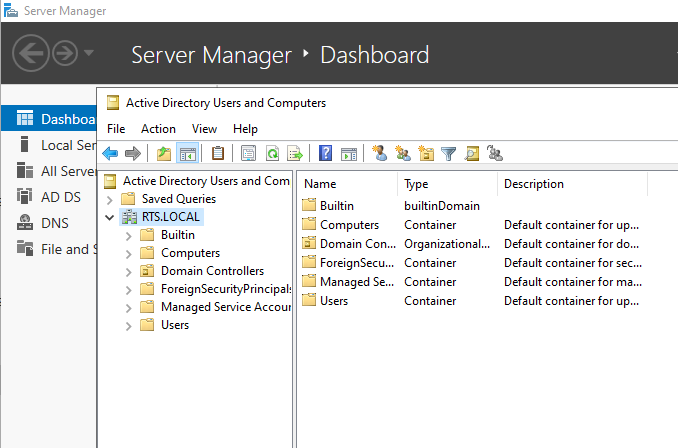

# Active-Directory-on-Windows-Server
My Active Directory notes

## Introduction of Active Directory
Active Directory is a Microsoft service that provides centralized authentication and authorization to network resources. It’s used in business environments to simplify user management, control access to data, and enforce company security policies.

how it works:
1) Authentication: Active Directory verifies a user’s credentials (username and password). The user’s credentials are stored in the Active Directory database.
2) Authorization: This process grants or denies a user to do something such as edit a file or access an application.

Active Directory is especially useful for companies that have to manage lots of endpoints and servers. It stores information about objects on the network and makes this information easy for administrators and users to find and use. Objects might include user accounts, computer accounts, and resources like file and print servers.

Active Directory Domain Services (AD DS) is the main component of Active Directory. It’s the Server Role in Windows Server that you install if you want to promote the server to a domain controller (DC). DCs host a copy of the AD database and they perform authentication and authorization functions to make resources and data available to network users and administrators.

Active Directory is for almost any company or organization out there. It simplifies life for administrators and end users while enhancing security for organizations. Administrators and end users share the centralized user and rights management, as well as centralized control over computer and user configurations through the AD Group Policy feature.

   

## Windows Server installation on Virtual Box

1) Download the ISO from the following link: https://www.microsoft.com/evalcenter  -> select windows server -> select the version -> click (next to get started) download the ISO -> sign in and download.
   
2) Download Virtual Box and install the OS.

## Configure some settings before installing Active Directory
After installing the O.S. We need configure these settings:

 - Activate windows (start -> control panel -> system and security -> system -> check windows status, if activeted -> ok, else -> click on active windows)
 - Rename the computer name to RTS-DC1 (server manager -> local server -> click on computer name and rename it)
 - Change the network to internal (DEVICES -> NETWORK SETTINGS-> select INTERNAL NETWORK)
 - Set a static IP address (Network and Internet -> Network Connections -> right click on ethernet properties -> double click on tcp ipv4 -> and set up an static ip address 192.168.1.250 -> subnet 255.255.255.0 and dns server 192.168.1.250)
 - Mouse integration (in alto di virtual box -> mouse integration)
 - To Unlock the windows server (insert -> ctrl+alt+del)

Check your configuration in local server
   

## Active Directory Overview e Terminology
 - Domain -> collection of objects (users acc,computers acc, groups… and more)
 - Domain Controller -> server with the active directory installed)
 - Tree -> collection of a domains
 - Forest -> collection of trees
 - Global Catalog -> it’s a central repository containing a subset of attributes of all objects in the AD forest.
 - DNS -> resolve a name to ip address

## Methods to install Active Directory 
 - Powershell (install windows feature AD Domain Services and ADDSDomainController)
 - Server Manager (Add roles and features)
 - DCPromo /Unattend: <path> (with a file, minimize errors)

## Active Directory installation
To install AD go to: manage -> add roles and features
   
   
   
   

Click next until install.

### Domain Controller Promotion
After installation will pop up a warning 
   
Click on Promote (it will promote the server in domain controller)
Follow the images below:
   
   
   
In the first installation it will install the dns, so let uncheck if first installation.
   
   
   
Click next until finish and reboot the system.

### Verify your installation
You can see in your log screen your domain.
   
first check to do:
server manager -> Tools -> Active Directory Users and Computers -> it's present the domain RTS.LOCAL.
   
second check to do:
server manager -> Tools -> DNS -> forward lookup zones -> expand _msdcs.rts.local -> check if the Kerberos and LDAP services are present.
   

We can check the installation with some commands:
 - get-WindowsFeature
 - get-windowsfeature -name rsat
 - get-windowsfeature -name rsat*

We could install AD also with powershell commands 
 - install-windowsFeature ad-domain-services
 - install-ADDSDomain -DomainName rts.local -SiteName default-first-site-name -InstallDns
 - install-windowsfeature rsat-role-tools

## Tools
Brief description of main tools:

 - Active Directory Users and Computers (ADUC): This is a Microsoft Management Console (MMC) snap-in that provides a graphical user interface for administrators to manage objects such as users, groups, and computers within their Active Directory domains. It allows administrators to create and manage AD objects, such as users, computers, groups, and contacts, along with their attributes.
 - Active Directory Administrative Center (ADAC): This is a tool provided by Microsoft that helps admins perform typical AD actions. It includes management features for Active Directory Recycle Bin, Fine-Grained Password Policy, and Windows PowerShell History Viewer.
 - Active Directory module for Windows PowerShell: This is a PowerShell module that consolidates a group of cmdlets. You can use these cmdlets to manage your Active Directory domains, Active Directory Lightweight Directory Services (AD LDS) configuration sets, and Active Directory Database Mounting Tool instances in a single, self-contained package.
 - Active Directory Sites and Services: This is a Microsoft Management Console (MMC) snap-in that provides a graphical user interface for administrators to manage the relationship between Domain Controllers, sites, and services within an Active Directory forest. It is used for managing organizations that have branches spread across different geographical locations but fall under the same domain.
 - Active Directory Domains and Trusts: This is a tool used to manage trust relationships between domains within an Active Directory forest. Trust relationships enable access to resources and can be either one-way or two-way.
 - Active Directory Schema: This is a blueprint that describes the rules about the type of objects that can be stored in the AD as well as the attributes related to these objects. The schema defines the content, and the structure of the object classes, and the object attributes used to create an object.

## Active Directory Schema
The schema defines which objects you can create and also defines its attributes. So if you define a user object, you also define its attributes.
 - object classes (user, computer, group, etc.)
 - attributes (tel. number, address, name, etc.)

### Schema Access
Add the schema access
Open run (windows +R) and write: regsvr32 schmmgmt.dll
   

Now Open run (windows +R) and write: mmc -> file -> add/remove snap-ins -> select Active Directory Schema -> Ok
   
To decide who is the schema master among the various domain controllers -> right click on the Active Directory Schema folder -> Operations Master -> change master schema .
   

### Modifying the Schema
run -> mmc -> file- > add or remove snap-ins-> add active directory schema-> on attributes -> right click and create new attributes -> you cannot delete an attribute, you can only disable it.
   
Check the new attributes on user -> properties-> on attributes -> to link it to the classes -> add it.

## Global Catalog
The global catalog records a partial list of attributes of all domains in the forest, supporting queries on resources in other domains in the forest. If there are domains in the same forest that want to talk to each other, they need this global catalog server to get the various information.

### Configuring the Global Catalog
tools -> active directory sites and services
   

   
# Author
<b>Xiao Li Savio Feng</b>
